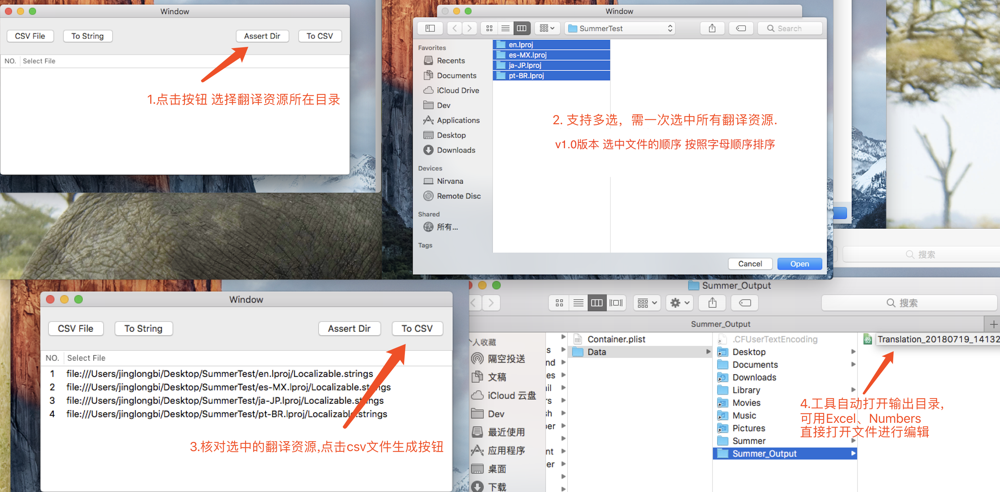
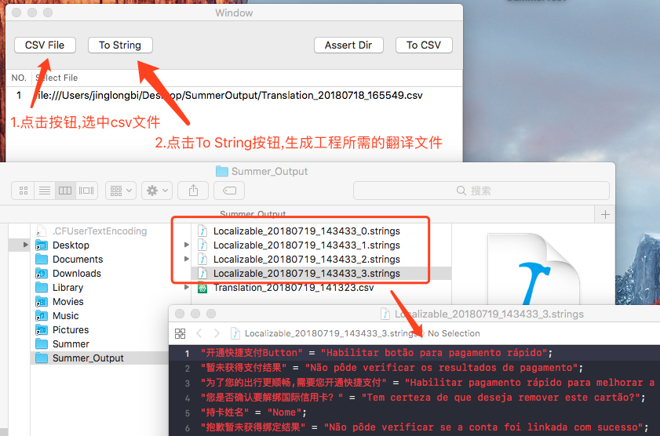

## Summer - 适用于Xcode项目的翻译资源维护工具

### 翻译问题维护现状:

产品在PRD中提供不同语言的翻译 > 开发同学手工在不同语言的翻译文件中复制/粘贴. > Local/QA 反馈翻译问题 > RD找PM确认翻译 > 开发同学手工在不同语言翻译文件中替换 > Local/QA复现 验证

#### 问题:

1. 流程长,一个翻译问题背后的验证、确认成本高.

2. 翻译标准难确定,问题常常反复提.

3. 手工粘贴 重复操作 易出错(西班牙语 葡萄牙语搞混).

4. 输入中文符号或者少输入一个分号 导致翻译文件解析失败.

5. 无法直观体现各种语言下翻译缺失的情况.

### Summer - 功能与翻译资源处理过程简述:

1. 抽取项目中不同语言的翻译文件到一个csv文件.

2. 由csv文件生成不同语言的翻译文件.

### 使用说明:

##### Step One:

使用Summer抽取组件中的多个翻译文件到一个csv文件 > Git维护这个csv文件的版本 > 产品/翻译同学在Excel导入翻译csv文件，对翻译进行更新。

##### Step Two:

RD拿到更新后的Excel > 导出csv文件 > Git更新这个csv文件 > 确认变动后，借助Summer工具由csv文件生成不同语言的翻译文件。

##### 日常需求开发

日常需求开发中，新增翻译资源也可在csv文件中统一添加不同语言的翻译。之后一次性导出更新后的翻译资源。

### 优化点:

1. 直观体现各种语言下翻译缺失的情况.

2. 减少RD重复操作,避免手工粘贴产生的错误.

3. 对产品/翻译/QA同学来说一定程度上的翻译文案所见即所得.

### Release

[Summer v1.0](./release/v1.0)

### Other

1. 与其他方案比较:接入成本较XLIFF、Weblate低.

2. [Android翻译文件格式支持](https://github.com/LiewJunTung/Android-strings-xml-csv-converter)

3. 翻译资源自治 > iOS/Android翻译资源由同一份csv文件生成 > 打包时选择翻译资源版本
